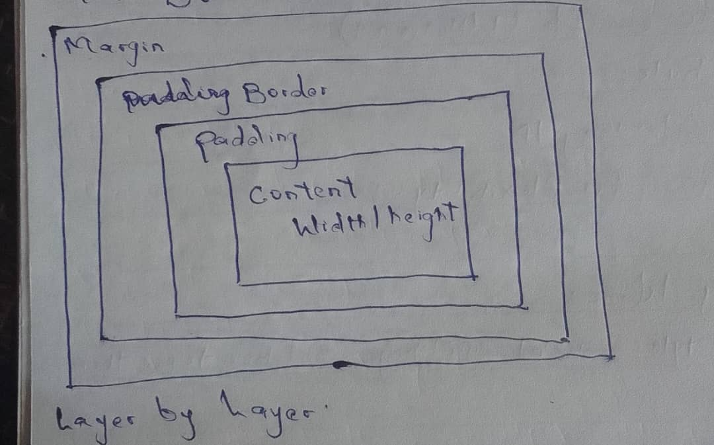
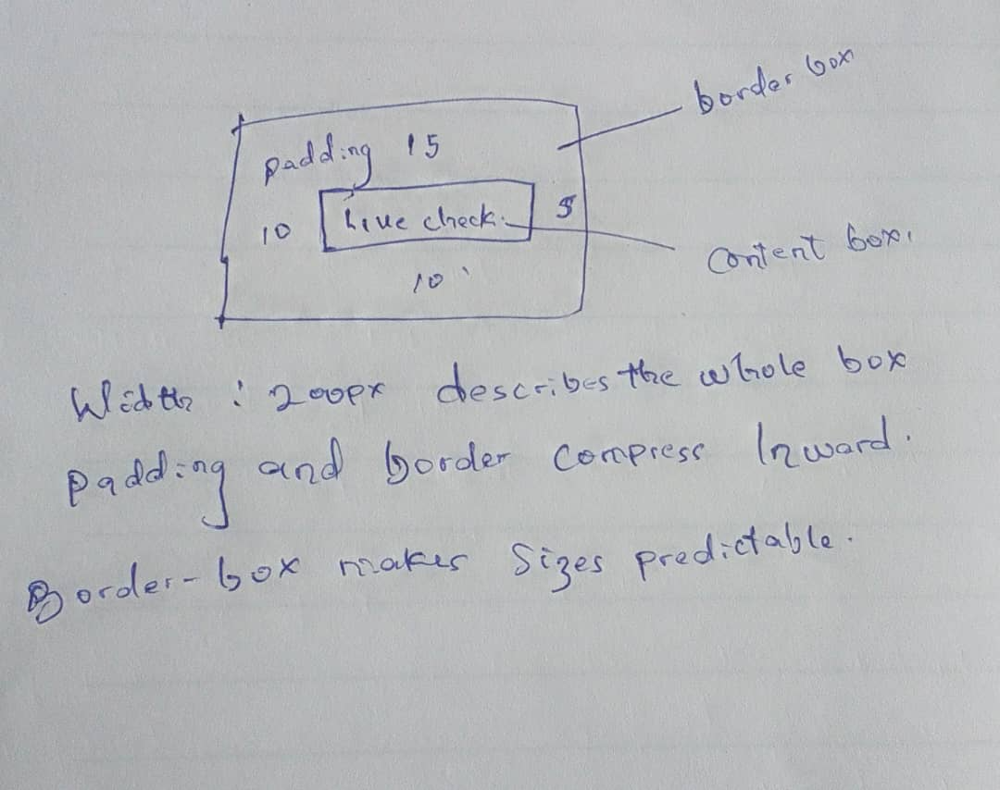

THEORY 

QUESTION 1

If one div has margin-bottom: 20px and follow by margin-top: 30px, space between them will be 30px because the are adjacent block level elements and wont add together. it will look for larger margin and olds the other intothe larger one which is the 30px gap. 

QUESTION 2 

The .header nav ul li a selector wins the calculation because in specificity it works with the vector score line and the rank is below. 
ID - The highest ranking 
class - Middle Ranking 
Element - Lowest Ranking 

calculation

.header nav ul li a - Score vector (0, 1 4) and elemnent have the highest score here 

 nav a.active - Score vector (0, 1, 2) and this will follow the ranking

.nav-links a - Score vector (0, 1, 1)

QUESTION 3 

The CSS Cascade (Who Wins?)

The browser decides how styles are applied using3
main concepts:
Cascade → which rule wins 
Specificity → how strong a selector is 
Inheritance → what styles are passed down 

understanding this 3 main concept will help you not to write unnecessary CSS styling. 

ENGINEERING THINKING 

QUESTION 1

By default, CSS applies the content-box model, which means any padding add expands outward from initial  dimensions. If i set a width of 200px and a padding of 10px on all sides, the browser computes the final rendered width as 220px (Content + Left Padding + Right Padding). 

Box Sizing:it controls how an element's total width and height are calculated. 

To fix this we can just add box-sizing:
.class {
  width: 200px;
  padding: 10px;
  box-sizing: border-box;
}

QUESTION 2 

